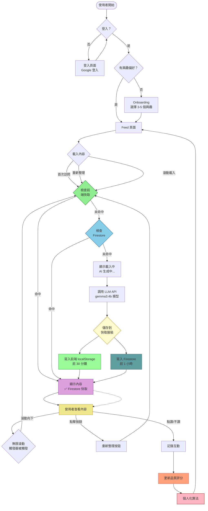
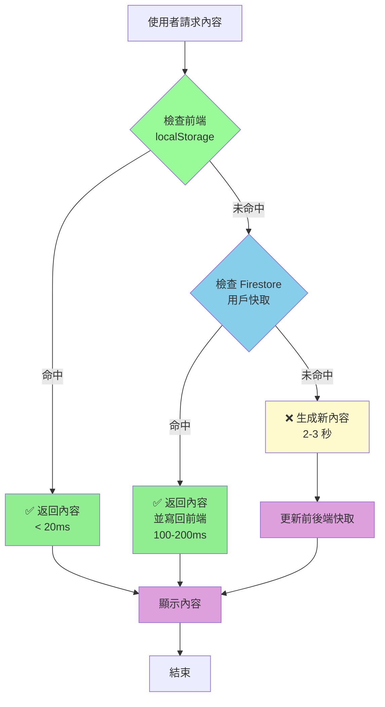
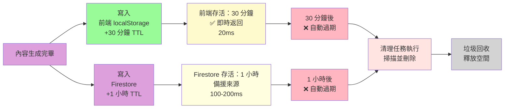

# AI 個人化內容資訊流平台 - 使用者流程循環說明

**文件日期**: 2026-01-24
**目標**: 說明使用者與系統的完整互動流程，以及快取機制在其中扮演的角色

---

## 📊 流程總覽

```
使用者 → 登入 → Onboarding → Feed 內容 → 互動 → 個人化生成 → Feed 內容（循環）
                      ↑                                      ↓
                      └───── 品質評分 & 行為分析 ─────┘
```

---

## 🔄 完整流程循環圖

### 主流程圖（含快取層級）



---

## 📋 詳細流程說明

### 階段 1：登入與 Onboarding

#### Step 1: 登入頁面
```
┌─────────────────────────────────┐
│     AI 個人化內容資訊流         │
│                                 │
│  [Google 登入按鈕]              │
│                                 │
│  我們的承諾：                 │
│  • 使用 Google 帳戶登入         │
│  • 根據興趣 AI 生成內容       │
│  • 點讚/不讚 優化 AI          │
└─────────────────────────────────┘
         ↓ 點擊登入
```

#### Step 2: Onboarding（首次登入）
```
┌─────────────────────────────────┐
│  選擇你的興趣偏好             │
│                                 │
│  請選擇至少 3 個興趣標籤：     │
│                                 │
│  □ 人工智慧  □ 科技  □ 學習    │
│  □ 創業    □ 健康  □ 旅遊     │
│  □ 美食    □ 音樂  □ 電影     │
│  ...                              │
│                                 │
│  已選擇 3 / 5                    │
│                                 │
│  [開始體驗 AI 內容]            │
└─────────────────────────────────┘
         ↓ 儲存興趣到 Firestore
         ↓ 跳轉到 Feed 頁面
```

---

### 階段 2：首次載入內容

#### 流程圖

```mermaid
graph TD
    subgraph [首次載入 - 快取未命中]
        A{首次訪問 Feed} -->|無前端快取| B{檢查 Firestore}
        B -->|無 Firestore 快取| C[顯示載入中<br/>AI 生成中...<br/>預計 2-3 秒]
        C --> D[調用 Ollama API<br/>gemma3:4b 模型]
        D --> E[接收 JSON 回應]
        E --> F[解析內容]
        F --> G[儲存到 Firestore<br/>1 小時 TTL]
        G --> H[儲存到前端 localStorage<br/>30 分鐘 TTL]
        H --> I[顯示 10 則內容]
    end
    
    subgraph [快速載入 - 前端快取命中]
        J{再次訪問 Feed} -->|有前端快取| K[立即顯示<br/>< 20ms]
        K -.-> Show[顯示內容]
    end
    
    subgraph [備援載入 - Firestore 快取命中]
        A -->|有 Firestore 快取| L[載入 Firestore<br/>100-200ms]
        L --> I[顯示內容]
    end
    
    Show --> Next[使用者查看內容]
    
    style A fill:#FFE4E1
    style B fill:#FFFACD
    style C fill:#FFFACD
    style D fill:#D3D3D3
    style E fill:#D3D3D3
    style F fill:#D3D3D3
    style G fill:#98FB98
    style H fill:#98FB98
    style I fill:#DDA0DD
    style K fill:#90EE90
    style L fill:#87CEEB
```

#### 關鍵時間點

| 狀態 | 時間 | 說明 |
|------|------|------|
| 前端快取命中 | < 20ms | 幾乎即時，無感知 |
| Firestore 快取命中 | 100-200ms | 很快，輕微感覺延遲 |
| LLM 生成新內容 | 2-3 秒 | 明顯等待，需要提示 |

---

### 階段 3：內容循環與互動

#### 完整互動流程圖

```mermaid
graph TD
    subgraph [核心循環：內容載入 → 顯示 → 互動 → 優化]
        direction TB
        A1[使用者看到內容] --> A2[檢查互動狀態<br/>未點讚、未看過]
        
        A2 --> A3{使用者行為？}
        
        A3 -->|滾動向下| A4[滾動到底部<br/>觸發 Sentinel]
        
        A3 -->|點擊按鈕| A5[點擊重新整理]
        
        A3 -->|點讚/不讚| A6[點擊互動按鈕]
        
        A3 -->|停止查看<br/>> 3秒+| A7[停止查看超時]
        
        A4 --> A8[檢查快取]
        A5 --> A8
        
        A8 --> A9{快取狀態？}
        
        A9 -->|前端快取命中| A10[立即顯示<br/>< 20ms<br/>從 localStorage]
        
        A9 -->|前端未命中| A11{Firestore?}
        
        A11 -->|有快取| A12[載入 Firestore<br/>100-200ms]
        A11 -->|無快取| A13[顯示載入中<br/>AI 生成中...]
        
        A13 --> A14[調用 LLM API]
        A12 --> A15[儲存到前端 localStorage]
        
        A14 --> A16[接收新內容]
        
        A16 --> A17[儲存到 Firestore<br/>1 小時]
        A17 --> A18[儲存到前端 localStorage<br/>30 分鐘]
        
        A18 --> A19[顯示新內容<br/+ 10 則]
        
        A10 --> A19
        A12 --> A19
        
        A19 --> A1
    end
    
    subgraph [品質評分優化循環]
        B1[點讚: +5 分] --> B2[不讚: -8 分]
        B2 --> B3[查看: +0 到 +1 分]
        B3 --> B4[停留 3 秒+: +6 到 +15 分]
        
        B4 --> B5[更新內容品質評分]
        B5 --> B6{品質評分<br/>變化?}
        
        B6 -->|提升| B7[提升權重<br/>下次更優先<br/>推薦此類內容]
        B6 -->|降低| B8[降低權重<br/>減少推薦]
        B6 -->|穩定| B9[維持權重]
    end
    
    subgraph [快取管理與維護]
        C1[前端 localStorage<br/>監控]
        C2[Firestore<br/>監控]
        
        C1 --> C3{清理過期快取}
        C2 --> C3
        
        C3 --> C4[刪除 30 分鐘前<br/>的 localStorage]
        C3 --> C5[刪除 1 小時前<br/>的 Firestore]
        
        C5 --> Done[完成]
    end
    
    Done --> Next[下一次請求]
    
    A6 --> B1
    A7 --> B4
    
    style A1 fill:#F0E68C
    style A4 fill:#FFFACD
    style A6 fill:#90EE90
    style A7 fill:#FFE4B5
    style A10 fill:#98FB98
    style A13 fill:#FFFACD
    style A14 fill:#D3D3D3
    style A19 fill:#DDA0DD
    style B7 fill:#98FB98
    style B8 fill:#FFB6C1
    style C4 fill:#DDA0DD
    style C5 fill:#DDA0DD
```

---

## 🎯 快取機制詳細說明

### 三層快取架構

```
┌─────────────────────────────────────┐
│  Tier 3: 生成層                      │
│  ┌─────────────────────────────┐   │
│  │ LLM API (gemma3:4b)         │   │
│  │ • 熱時間：2-3 秒            │   │
│  │ • 觸發條件：無快取時        │   │
│  │ • 更新頻率：每日一次左右   │   │
│  └─────────────────────────────┘   │
└─────────────────────────────────────┘
               ↓ 儲存
┌─────────────────────────────────────┐
│  Tier 2: Firestore 層（用戶獨立）   │
│  ┌─────────────────────────────┐   │
│  │ Firestore 文檔           │   │
│  │ • 路徑: aipcs_cache:{uid}│   │
│  │ • TTL: 1 小時               │   │
│  │ •觸發: 前端未命中時       │   │
│  │ • 預留時間: 跨裝置、跨瀏覽器 │   │
│  │ • 備份: 用戶 A 的快取不會<br/>      │
│ │   影響用戶 B 的快取         │   │
│  └─────────────────────────────┘   │
└─────────────────────────────────────┘
               ↓ 復寫入
┌─────────────────────────────────────┐
│  Tier 1: 前端 localStorage 層             │
│  ┌─────────────────────────────┐   │
│  │ localStorage              │   │
│  │ • 路徑: aipcs_cache_{uid} │   │
│  │ • TTL: 30 分鐘              │   │
│  │ • 觸發: 頁面載入時         │   │
│  │ • 優點：最快（< 20ms）     │   │
│  └─────────────────────────────┘   │
└─────────────────────────────────────┘
```

### 快取命中流程



### 快取更新流程

```mermaid
graph TD
    Generate[生成新內容完成] --> Save1[寫入前端<br/>localStorage]
    Save1 --> Save2[寫入 Firestore]
    
    Save2 --> Update1{更新快取時間戳}
    
    Update1 --> Done[完成]
    
    subgraph [後台清理任務]
        Clean1[前端快取清理任務] --> Clean1a[每 10 分鐘掃描]
        Clean1a --> Clean1b[刪除 30 分鐘前的<br/>快取]
        
        Clean2[Firestore 清理任務] --> Clean2a[每小時掃描]
        Clean2a --> Clean2b[刪除 1 小時前的<br/>快取文檔]
    end
    
    Done -.後台運行.-> Clean1
    Done -.後台運行.-> Clean2
    
    style Generate fill:#DDA0DD
    style Save1 fill:#98FB98
    style Save2 fill:#DDA0DD
    style Update1 fill:#FFFACD
```

---

## 🔄 使用者典型場景流程

### 場景 1：首次使用（冷啟動）

```
┌────────────────────────────────────────┐
│  用戶：全新使用者                      │
│  時間：首次登入                       │
└────────────────────────────────────────┘
                    ↓
1. Google 登入 → 成功
                    ↓
2. Onboarding → 選擇「人工智慧、科技、學習」
                    ↓
3. 跳轉到 Feed 頁面
                    ↓
4. 檢查快取：
   - 前端 localStorage：❌ 無
   - Firestore：❌ 無
   → 需要生成
                    ↓
5. 顯示：「AI 生成中...預計 2-3 秒」
                    ↓
6. LLM API 生成 10 則內容
                    ↓
7. 儲存到 Firestore + 前端 localStorage
                    ↓
8. 顯示 10 則內容
                    ↓
9. 用戶瀏覽內容
```

### 場景 2：短時間內返回（熱快取）

```
┌────────────────────────────────────────┐
│  用戶：已登入使用者                    │
│  時間：5 分鐘後返回                   │
└────────────────────────────────────────┘
                    ↓
1. 重新進入 Feed 頁面
                    ↓
2. 檢查快取：
   - 前端 localStorage：✅ 有內容（5 分鐘前生成）
   → 立即返回（< 20ms）
                    ↓
3. 顯示 10 則舊內容
→ 使用者體驗：即時、流暢
```

### 場景 3：30 分鐘後返回（快取過期）

```
┌────────────────────────────────────────┐
│  用戶：已登入使用者                    │
│  時間：30 分鐘後返回                  │
└────────────────────────────────────────┘
                    ↓
1. 重新進入 Feed 頁面
                    ↓
2. 檢查快取：
   - 前端 localStorage：❌ 過期
   - Firestore：✅ 有內容
   → 載入 Firestore（100-200ms）
                    ↓
3. 儲存到前端 localStorage（重新快取）
                    ↓
4. 顯示 Firestore 內容
→ 使用者體驗：快速，稍有感知延遲
```

### 場景 4：1 小時後返回（快取完全過期）

```
┌────────────────────────────────────────┐
│  用�：已登入使用者                     │
│  時間：1 小時後返回                    │
└────────────────────────────────────────┘
                    ↓
1. 重新進入 Feed 頁面
                    ↓
2. 檢查快取：
   - 前端 localStorage：❌ 過期
   - Firestore：❌ 過期
   → 需要重新生成
                    ↓
3. 顯示：「AI 生成中...預計 2-3 秒」
                    ↓
4. LLM API 生成新內容（根據累積的品質評分優化）
                    ↓
5. 儲存到 Firestore + 前端 localStorage
                    ↓
6. 顯示新內容
→ 使用者體驗：有感等待，但內容更個人化
```

### 場景 5：點擊「重新整理」按鈕

```
┌────────────────────────────────────────┐
│  操作：點擊「重新整理」按鈕          │
│  意圖：獲取最新內容                   │
└────────────────────────────────────────┘
                    ↓
1. 按鈕變為 loading 狀態
                    ↓
2. 檢查快取：
   - 前端 localStorage：⏰️ 可能過舊
   - Firestore：⏰️ 可能過舊
   → 直接發起生成請求
                    ↓
3. 顯示：「AI 生成中...」
                    ↓
4. LLM API 生成新內容 + 考慮品質評分
                    ↓
5. 覆寫快取（前端 + Firestore）
                    ↓
6. 更新 Feed，顯示新內容
→ 使用者體驗：有明確的「重新整理」回饋
```

### 場景 6：無限滾動載入

```
┌────────────────────────────────────────┐
│  操作：使用者滾動到最底部            │
│  觸發：Sentinel 元素被看見              │
└────────────────────────────────────────┘
                    ↓
1. Sentinel 觸發
                    ↓
2. 檢查快取：
   - 前端 localStorage：可能較舊的部分
   - Firestore：可能較舊的部分
   → 嘗試載入更多內容
                    ↓
3. 顯示「載入更多...」
                    ↓
4. 檢查快取是否有更多內容
   - 如果有：返回快取內容
   - 如果否：生成新內容
                    ↓
5. 新內容追加到 Feed（不替換舊內容）
→ 使用者體驗：流暢的無限滾動
```

### 場景 7：點讚/不讚互動

```
┌────────────────────────────────────────┐
│  操作：使用者點擊「讚」按鈕          │
│  當前狀態：尚未點讚                   │
└────────────────────────────────────────┘
                    ↓
1. 按鈕變為「已讚」狀態（樂觀更新）
                    ↓
2. 呼叫 API 記錄互動
                    ↓
3. 如果 API 成功：
   - 更新 Firestore 互動記錄
   - 更新內容品質評分（+5 分）
   - 儲存到 localStorage（記錄點讚狀態）
                    ↓
4. 如果 API 失敗：
   - 回滾 UI 狀態（取消「讚」）
   - 顯示 Toast：「操作失敗，請重試」
                    ↓
5. 偵留 3 秒後觸發「長停留」事件
   - 如果仍在查看：品質分數 +6 到 +15 分
                    ↓
品質評分更新 → 影響下次內容生成優先順序
```

---

## 💾 快取生命週期



### 快取過期時間軸

```
時間軸：0 → → 100%
────────────────────────────────────────────

0 分鐘：內容生成
  ✅ 前端快取：剛寫入，有效
  ✅ Firestore 快取：剛寫入，有效
  → 使用者感覺：即時

5 分鐘：用戶暫離再返回
  ✅ 前端快取：仍有效（距離過期還有 25 分鐘）
  ✅ Firestore 快取：仍有效（距離過期還有 55 分鍾）
  → 使用者感覺：瞬間載入

30 分鐘：前端快取過期
  ❌ 前端快取：已過期
  ✅ Firestore 快取：仍有效（距離過期還有 30 分鍾）
  → 使用者感覺：快速載入（< 200ms）

45 分鐘：用戶再返回
  ❌ 前端快取：已過期
  ✅ Firestore 快取：仍有效
  → 使用者感覺：快速載入（< 200ms）

60 分鐘：前端和 Firestore 快取都過期（1 小時）
  ❌ 前端快取：已過期
  ❌ Firestore 快取：已過期
  → 使用者感覺：需要等待（2-3 秒）
```

---

## 🎯 快取觸發時機總表

| 操作 | 前端 localStorage | Firestore | LLM API | 優先級 |
|------|-----------------|----------|---------|--------|
| 首次登入 | ❌ | ❌ | ✅ | 無必要 |
| 5 分鐘內返回 | ✅ | 無必要 | ❌ | 前端優先 |
| 30 分鐘後返回 | ❌ | ✅ | ❌ | Firestore 補儲 |
| 30 分鐘內再返回 | ✅ | ✅（重新快取） | ❌ | 前端優先 |
| 30 分鐘後再返回 | ✅ | ❌（無需） | ❌ | 前端優先 |
| 1 小時後返回 | ❌ | ❌ | ✅ | 必要生成 |
| 點擊「重新整理」 | ❌ | ❌ | ✅ | 忽略舊快取 |
| 滾動載入更多 | ✅ 看是否有 | ✅ 看是否有 | ❌/✅ | 盡量用快取 |
```

**優先級說明**：
- ✅：執行此動作
- ❌：不執行此動作
- 看是否有：檢查後再決定

---

## 📊 品質評分與個人化循環

### 評算法影響鏈

```
使用者互動 → 品質評分更新 → 影響權重 → 下次生成優先順序 → 快取內容變化 → 使用者體驗優化

舉例：

循環 1:
├─ 點讚「科技」類內容 → 品質評分 +5 → 億先權重提升 → 下次生成更多「科技」內容 → 快取中「科技」內容增多
└─ 使用者看到更多「科技」內容 → 滿意度提升 ✅

循環 2:
├─ 不讚「健康」類內容 → 品質評分 -8 → 優先權重降低 → 下次減少「健康」內容 → 快取中「健康」內容減少
└─ 使用者看到更少「健康」內容 → 負性反饋 ❌
    ↓
├─ 如果不讚後，3 秒後點讚 → 可能是誤操作 → 恢復評分
└─ 使用者看到「健康」內容恢復 ✅

循環 3:
├─ 停留 5 秒 → 品質評分 +15 → 優先權重提升 → 下次生成類似長內容
└─ 使用者看到更多需要細嚼內容 → 吸引力提升 ✅
```

### 品質評分公式

```
最終品質評分 = 基礎分數 + (點讚權重 × 點讚數) + (不讚權重 × 不讚數)

其中：
- 基礎分數 = 70（預設）
- 點讚權重：根據使用者偏好和歷史動態計算（預設 5）
- 不讚權重：根據內容類型和情況調整（預設 -8）
```

---

## 🔴 關鍵警告與注意事項

### 快取衝突避免

⚠️ **重要**：不同客戶的快取必須獨立

**錯誤示例**（跨用戶共享）:
```
Firestore 快取
├─ cache: [科技內容]
├─ 用戶 A 請求 → 返回科技內容
├─ 用戶 B 請求 → 也返回科技內容 ❌ 不適合
└─ 用戶 B 偏好「健康」，但看到「科技」❌
```

**正確示例**（用戶獨立）:
```
Firestore 快取
├─ aipcs_cache:user_123: [AI 內容、科技內容]     ← 用戶 123
├─ aipcs_cache:user_456: [健康內容、旅遊內容]   ← 用戶 456
└─ aipcs_cache:user_789: [音樂內容、美術內容]   ← 用戶 789

每個用戶的快取根據其偏好（興趣標籤）生成，互不干擾
```

### 快取過期清理

**自動清理任務**:

| 層級 | TTL | 清理頻率 | 驗動方式 |
|------|-----|---------|----------|
| 前端 localStorage | 30 分鐘 | 每 10 分鐘掃描 | 前端定時清理 |
| Firestore | 1 小時 | 程序清理或 Cron Job | 雲端腳本或 Firebase Scheduled Functions |
| 模擬資料 | N/A | N/A | 不使用（已移除） |

### 無「降級模擬資料」

**修正後的錯誤處理**:

```
❌ 舊做法：
LLM API 失敗 → 返回模擬資料

✅ 正確做法：
LLM API 失敗 → 
  ├─ 顯示 Toast：「AI 生成服務暫時無法使用」
  ├─ 提供重試按鈕
  └─ 或允許使用者稍後再試
```

**為何不使用降級模擬資料？**

1. **誤導性**：用戶以為是 AI 生成，實際是假資料
2. **違反真實性**：與「AI 生成」產品定位不符
3. **品質問題**：模擬資料可能不符合使用者偏好
4. **無意義**：如果降級到模擬資料，為什麼還要 AI 生成？

---

## 📈 效能優化流程圖

### 完整請求處理流程

```mermaid
graph TD
    Start[使用者請求內容] --> CheckLocal{前端<br/>localStorage}
    
    CheckLocal -->|命中| Success[✅ 立即返回<br/>< 20ms<br/>命中率最高]
    
    CheckLocal -->|未命中| CheckFirestore{Firestore<br/>用戶快取}
    
    CheckFirestore -->|命中| UpdateLocal[更新前端<br/>儲存回前端]
    CheckFirestore -->|未命中| Generate[LLM 生成]
    
    UpdateLocal --> Success
    
    Generate --> UpdateAll[更新雙層快取]
    
    UpdateAll --> Success
    
    subgraph [背景清理]
        CleanLocal[前端快取清理任務]
        CleanFirestore[Firestore 清理任務]
    end
    
    Success -.背景運行.-> CleanLocal
    Success -.背景運行.-> CleanFirestore
    
    style CheckLocal fill:#98FB98
    style CheckFirestore fill:#87CEEB
    style Generate fill:#FFFACD
    style UpdateAll fill:#DDA0DD
    style Success fill:#90EE90
    style UpdateLocal fill:#98FB98
```

### 性能目標監控

```
目標：
- 前端快取命中率：> 70%（短期訪問）
- Firestore 快取命中率：> 50%（中期訪問）
- API 回應時間（快取命中）：< 200ms
- API 回應時間（生成新內容）：< 3s

監控方式：
- 使用 Google Analytics 追蹤性能
- 日誌記錄快取命中情況
- Sentry 監控錯誤率
```

---

## 🎓 總結：使用者完整體驗循環

```
1. 登入（一次性）
   ↓
2. 選擇興趣（一次性）
   ↓
3. 載入內容（每次訪問）
   ├─ 檢查前端快取 → 命中立即顯示
   ├─ 檢查 Firestore 快取 → 載入稍慢但仍快
   └─ 無快取存在 → 生成新內容（2-3 秒等待）
   ↓
4. 查看內容（瀏覽、閱讀）
   ↓
5. 互動（點讚/不讚）
   ├─ 更新品質評分
   └─ 影響下次生成優先順序
   ↓
6. 繼續瀏覽（無限滾動）
   ├─觸發載入更多
   └─ 重複步驟 3
   ↓
7. 返回/重新整理（重複步驟 3）
   ↓
8. 離開（頁面關閉）
   ↓
   9. 下次返回（從步驟 3 開始）
```

**快取的角色**：
- **提升效能**：70%+ 請求無需等待（快取命中）
- **改善體驗**：快速載入，無感知延遲
- **降低成本**：減少 LLM API 調用次數
- **跨裝置同步**：Firestore 支援多裝置

---

**流程圖結束**

*本文件說明使用者與系統的完整互動循環*
*最後更新: 2026-01-24*